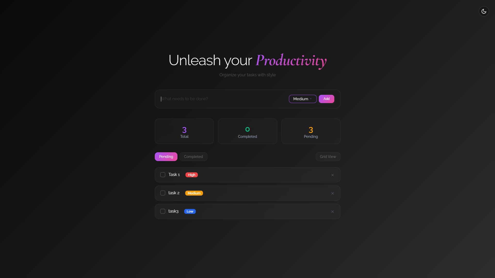

 # Minimal Todo New Tab Extension

A beautiful, minimal todo app for your new tab. Organize your tasks with style, set priorities, and enjoy a modern, theme-aware interface.



## Features
- Add, complete, and delete todos
- Set priority (High, Medium, Low) for each todo
- Sorts todos by priority and creation time
- Grid and list views
- Light and dark themes
- Stats for total, completed, and pending tasks
- Modern, responsive UI

## Installation (Local Development)

1. **Clone or Download the Repository**
   ```sh
   git clone <this-repo-url>
   # or download and unzip the folder
   ```

2. **Open Chrome and go to Extensions**
   - Visit `chrome://extensions/`
   - Enable **Developer mode** (top right)

3. **Load the Extension Locally**
   - Click **Load unpacked**
   - Select the `todo-extension` folder (the one containing `manifest.json`)

4. **Set as New Tab (if not automatic)**
   - The extension will override your new tab page with the todo app.
   - If not, click the extension icon and pin it for easy access.

## Usage
- Type your task and select a priority, then click **Add**
- Click the checkmark to complete a task, or the X to delete
- Use the filter tabs to view pending or completed tasks
- Switch between grid and list view
- Toggle between light and dark themes with the button in the top right

## Screenshot


---

**Enjoy your productive, beautiful new tab!**
# New-Tab-Todo-Extension
